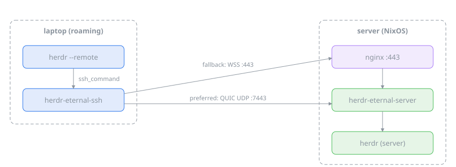

# herdr-eternal

Roaming-friendly transport for `herdr --remote`. OpenSSH connections die on
network changes, suspend, or flaky Wi-Fi and take the herdr remote session
down with them. herdr-eternal replaces ssh as herdr's transport with a
WebSocket channel that reconnects and resumes byte-exactly, so a netsplit is
invisible to herdr.

## Architecture



`herdr-eternal-ssh` is a drop-in for the ssh invocation herdr makes
(`remote.ssh_command`,
`nix/patches/0001-remote-make-ssh-transport-program-configurable.patch` until
it is upstream).

## Server deployment (NixOS)

```nix
{
  imports = [ herdr-eternal.nixosModules.default ];

  services.herdr-eternal-server = {
    enable = true;
    user = "joerg";                       # exec channels run as this user
    # Either a pre-shared token, OIDC, or both:
    tokenFile = config.sops.secrets.herdr-eternal-token.path;
    oidc = {
      issuer = "https://auth.example.com";
      clientId = "herdr-eternal";
      allowedSub = "joerg";
    };
    nginx = {
      enable = true;
      hostName = "example.com";           # existing TLS-terminating vhost
      location = "/herdr-eternal";
    };
    # Optional direct QUIC listener (roaming clients get connection
    # migration); reuses the ACME cert nginx already has and restarts the
    # service on renewal (sessions survive the restart).
    quic = {
      enable = true;
      useACMEHost = "example.com";
    };
  };
}
```

The WebSocket listener stays on localhost; nginx terminates TLS and proxies
the upgrade. The QUIC listener (UDP 7443 by default) terminates TLS itself
and is opened in the firewall.

## Client configuration

`~/.config/herdr-eternal/config.toml`:

```toml
[targets.mybox]
url = "wss://example.com/herdr-eternal"
# Either a pre-shared token ...
token = "..."
# ... or OIDC (then run: herdr-eternal-ssh login mybox)
issuer = "https://auth.example.com"
client_id = "herdr-eternal"
# Optional: expose the local SSH agent as SSH_AUTH_SOCK in the session
# (same trust implications as `ssh -A`).
forward_agent = true
# Optional: try a direct QUIC connection first, falling back to the
# WebSocket URL when UDP is blocked.
quic_addr = "example.com:7443"
```

herdr config:

```toml
[remote]
ssh_command = "herdr-eternal-ssh"
manage_ssh_config = false
```

Then use `herdr --remote mybox` as usual; the target name is looked up in the
client config instead of ssh_config.

## Development

```console
$ nix develop
$ cargo test --workspace
$ nix flake check   # clippy, tests (incl. patched-herdr e2e), NixOS VM test
```
